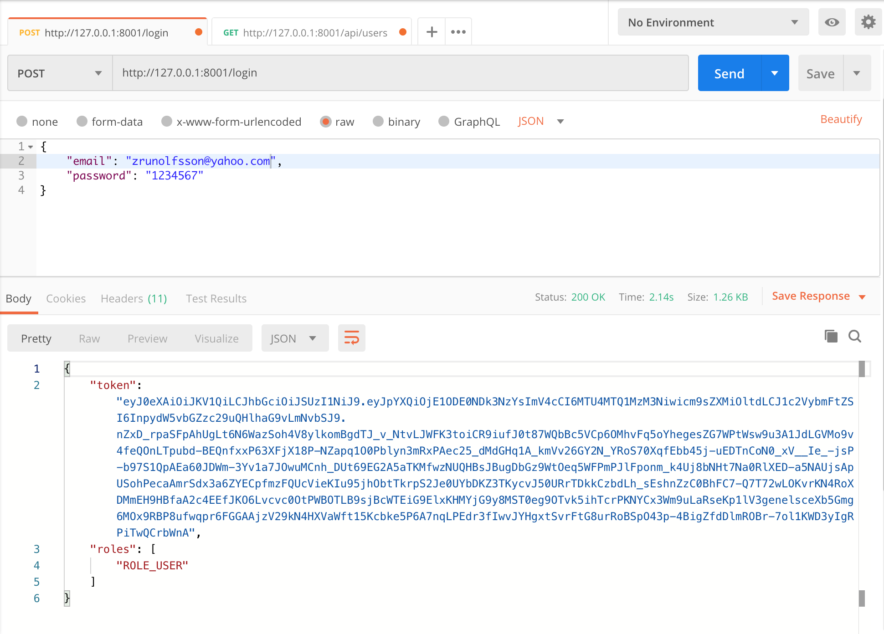

# MetraBit Symfony 5 (API platform) skeleton

Starter pack for MetraBit API projects based on API platform (https://api-platform.com/) and JWT token. Implemented Auth system for Vue.js client skeleton.

## Installation:
Make sure that you have installed last Docker version (https://docs.docker.com/install/). Clone current skeleton repository and execute following steps in the project root directory: 
```sh
$ docker-compose build
$ docker-compose up -d
```
Copy **.env.dist** to **.env** in project root directory.
```sh
$ cp .env.dist .env
```
Inside container install dependencies and update database with following command:
```sh
$ docker-compose exec php bash
$ composer install
$ ./reload_db.sh
```
Try to send login request via Postman (https://www.postman.com/):
